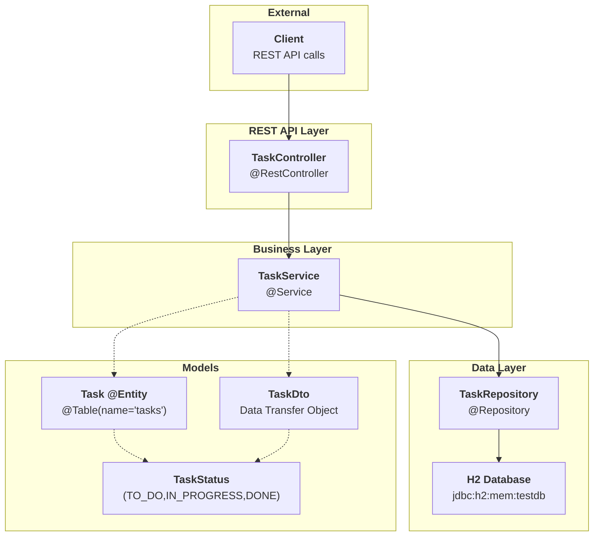
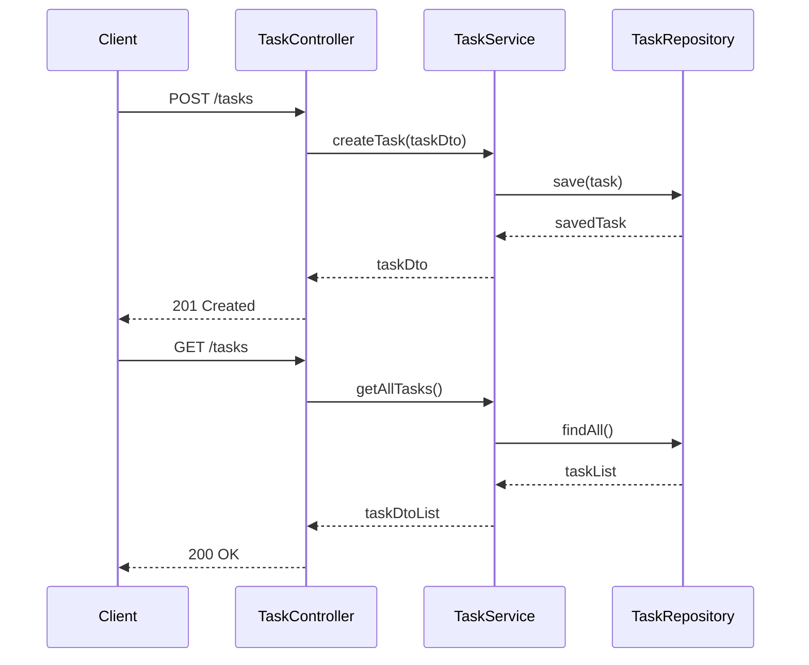

# Task Management System

A cloud-based web application providing basic task management with essential CRUD operations.

### 🖧 System Architecture

<details> <summary>System Architecture </summary> <pre>



</pre> </details>
<details> <summary>API Workflow</summary> <pre>



</pre> </details>
<details> <summary>Project Structure</summary> <pre>

```
tasksys/
├── pom.xml
├── .gitignore
├── ms.resume.md
├── src/
│   ├── main/
│   │   ├── java/
│   │   │   └── dev/
│   │   │       └── tasksys/
│   │   │           ├── TasksysApplication.java
│   │   │           ├── config/
│   │   │           │   └── OpenApiConfig.java
│   │   │           ├── controller/
│   │   │           │   └── TaskController.java
│   │   │           ├── exception/
│   │   │           │   ├── GlobalExceptionHandler.java
│   │   │           │   └── TaskNotFoundException.java
│   │   │           ├── model/
│   │   │           │   ├── Task.java
│   │   │           │   ├── TaskDto.java
│   │   │           │   └── TaskStatus.java
│   │   │           ├── repository/
│   │   │           │   └── TaskRepository.java
│   │   │           └── service/
│   │   │               └── TaskService.java
│   │   └── resources/
│   │       ├── application.properties
│   │       └── data.sql
│   └── test/
│       ├── java/
│       │   └── dev/
│       │       └── tasksys/
│       │           ├── TasksysApplicationTest.java
│       │           ├── controller/
│       │           │   └── TaskControllerTest.java
│       │           ├── integration/
│       │           │   └── TaskIntegrationTest.java
│       │           ├── repository/
│       │           │   └── TaskRepositoryTest.java
│       │           └── service/
│       │               └── TaskServiceTest.java
│       └── resources/
│           ├── application-test.properties
│           └── test-data.sql
└── target/
```

</pre> </details>

### Prerequisites

- Java 21 or later
- Maven 3.6+

### Getting Started

```bash
# Build
mvn clean install
# Run
mvn spring-boot:run
```

### Application Access

- API: `http://localhost:8080/api/tasks`
- H2 Console: `http://localhost:8080/h2-console`
- Swagger UI: `http://localhost:8080/swagger-ui.html`

### API Endpoints

- `POST /api/tasks` — Create a task
- `GET /api/tasks` — List all tasks
- `GET /api/tasks/{id}` — Retrieve a task by ID
- `PUT /api/tasks/{id}` — Update a task by ID
- `DELETE /api/tasks/{id}` — Delete a task by ID
- `GET /api/tasks/status/{status}` — Filter tasks by status

### Testing

```bash
# Run all tests
mvn test
# Run tests with coverage
mvn clean verify
# Run specific test class
mvn test -Dtest=TaskControllerTest
# Run integration tests
mvn test -Dtest="*IntegrationTest"
```

### Test Coverage

- Unit Tests: Controllers, Services, Repositories
- Integration Tests: Full API workflow
- Test Profiles: Separate H2 configuration for testing
