```mermaid
graph LR
    subgraph Public["🌐 Public Endpoints"]
        LOGIN["/api/auth/login"]
        REGISTER["/api/auth/register"]
        SWAGGER["/swagger-ui/**"]
    end
    
    subgraph Protected["🔒 Protected Endpoints"]
        TASKS["/api/tasks/**"]
    end
    
    subgraph Auth["🛡️ Authentication"]
        JWT_TOKEN["JWT Token<br>(expires 24h)"]
        USER_CONTEXT["User Context<br>(SecurityContext)"]
    end
    
    LOGIN --> JWT_TOKEN
    REGISTER --> JWT_TOKEN
    JWT_TOKEN --> USER_CONTEXT
    USER_CONTEXT --> TASKS
    
    TASKS --> |"Only user's own tasks"| USER_DATA[("👤 User's Tasks")]
```

# Task Management System

A cloud-based web application providing task management with user authentication and essential CRUD operations.

### Features
- **Task Management**: Each user manages their own tasks
- **CRUD Operations**: Create, Read, Update, Delete tasks
- **Task Status**: TO_DO, IN_PROGRESS, DONE
- **REST API**: Full REST API with Swagger documentation
- **Security**: Protected endpoints with proper authorization

### 🖧 System Architecture
<details> <summary>System Design </summary> <pre>


</pre> </details>
<details> <summary>ER Diagram</summary> <pre>


</pre> </details>
<details> <summary>Security Model</summary> <pre>



</pre> </details>
<details> <summary>Authentication Flow</summary> <pre>


</pre> </details>
<details> <summary>Task Management Flow</summary> <pre>


</pre> </details>
<details> <summary>Configuration Profiles</summary> <pre>****



</pre> </details>

```mermaid
graph TD
    subgraph DEV["🔧 Development Mode"]
        H2[(H2 Database<br>In-Memory)]
        SAMPLE[Sample Users & Tasks]
        CONSOLE[H2 Console /h2-console]
    end
    
    subgraph PROD["🚀 Production Mode"]
        PG[(PostgreSQL<br>Persistent)]
        DOCKER[Docker Compose]
        ENV[Environment Variables]
    end
    
    APP[Spring Boot App]
    
    APP -.->|default profile| DEV
    APP -.->|prod profile| PROD
```

### Prerequisites
- Java 21 or later
- Maven 3.6+
- Docker & Docker Compose

### Getting Started

**Clone the repository**
   ```bash
   git clone <github.com/mitchell7970/tasksys/>
   cd tasksys
   ```

**Start with H2 (Development Mode)**
   ```bash
   mvn clean install
   mvn spring-boot:run
   ```

**Start with PostgreSQL & pgAdmin4 (Production Mode)**
   ```bash
   docker-compose up -d postgres pgadmin
   mvn spring-boot:run -Pprod
   ```

**Full Docker Setup**
   ```bash
   mvn clean package
   docker-compose up --build -d
   ```

### Application Access

- **API**: `http://localhost:8080/api`
- **Swagger UI**: `http://localhost:8080/swagger-ui.html`
- **H2 Console**: `http://localhost:8080/h2-console` (Development Mode)
- **pgAdmin4**: `http://localhost:5050/` (Production Mode)

### API Endpoints
- #### Authentication
    - `POST /api/auth/login` — Login user
    - `POST /api/auth/register` — Register new user
- #### Tasks (Protected - Requires JWT Token)
    - `POST /api/tasks` — Create a task
    - `GET /api/tasks` — List user's tasks
    - `GET /api/tasks/{id}` — Get specific task
    - `PUT /api/tasks/{id}` — Update task
    - `DELETE /api/tasks/{id}` — Delete task
    - `GET /api/tasks/status/{status}` — Filter tasks by status

### Security
- JWT tokens expire in 24 hours
- Passwords hashed with BCrypt
- CORS enabled for development
- Protected endpoints require valid JWT
- Users can only access their own tasks

### Testing
```bash
# Run all tests
mvn test
# Run tests with coverage
mvn clean verify
# Run specific test class
mvn test -Dtest=TaskControllerTest
# Run integration tests
mvn test -Dtest="*IntegrationTest"
```

### Test Coverage
- Unit Tests: Controllers, Services, Repositories
- Integration Tests: Full API workflow
- Test Profiles: Separate H2 configuration for testing